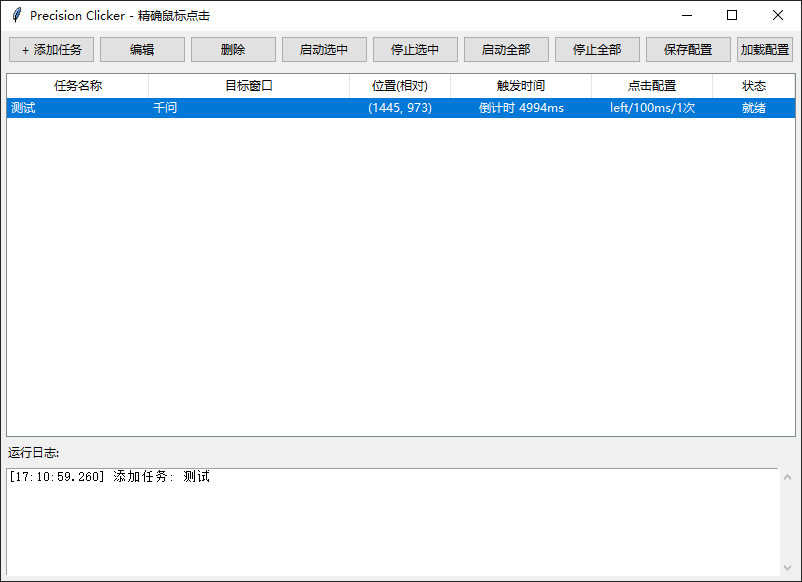

# Precision Clicker

一个 Windows 平台的精确鼠标点击自动化工具，支持毫秒级定时触发、窗口捕获和位置选取。

## 功能特性

- **毫秒级精度**：双层定时器策略，最后 1 秒内使用 CPU 忙等待，触发误差通常在 1~3ms。
- **窗口捕获**：自动列出所有可见窗口，支持前台窗口一键捕获。
- **位置选取**：点击"选取位置"后自动置顶目标窗口，鼠标点击即可记录相对坐标。
- **两种触发模式**：
  - 绝对时间：如 `12:00:00.100`
  - 倒计时：如 `5000ms`
- **自动激活窗口**：点击前自动恢复并置顶最小化的目标窗口。
- **任务列表**：支持多任务预设、保存/加载配置。
- **快捷键**：
  - `F5`：启动全部任务
  - `F6`：停止全部任务
- **即将开始提示**：任务触发前在日志区给出醒目标识。

## 运行环境

- Windows 7/10/11
- Python 3.7+
- 无需额外依赖（仅使用 Python 标准库 + tkinter）

## 软件界面



## 快速开始

```powershell
python precision_clicker.py
```

## 使用流程

1. 点击 **"+ 添加任务"**
2. 点击 **"捕获"** 选择目标程序窗口
3. 点击 **"选取位置"**，在目标窗口上点一下自动记录坐标
4. 选择触发模式（绝对时间或倒计时），设置间隔与次数
5. 保存任务，选中后按 **F5** 或点击 **"启动全部"**

## 技术细节

- 使用 `ctypes` 直接调用 Win32 API（`SendInput`、`SetWindowPos`、`SwitchToThisWindow` 等），无需安装 `pywin32`。
- 使用 `time.perf_counter()` 作为统一时间基准，避免 `datetime.timestamp()` 与 `perf_counter()` 混用导致的定时器溢出。

## License

MIT License
